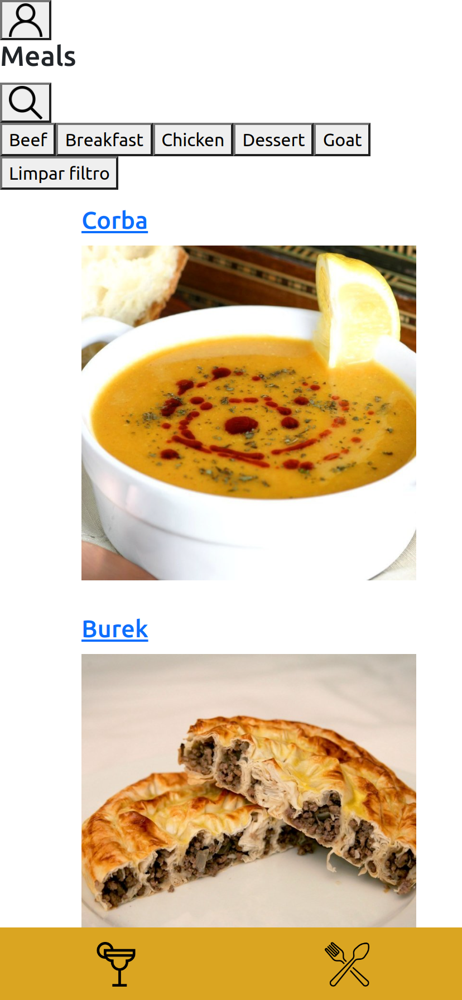

># Chefe de bolso

## Projeto completo! (Estilização em construção)

## Sobre o projeto
        Este projeto foi desenvolvido no módulo de front-end da Trybe, na data 15/05/2023 
        onde eu e meu grupo, constituído por: @gralbergomes, @odouglasoliveira e 
        @arthuurcordeiro, conseguimos colocar em prática os aprendizados até então.
        O projeto é um aplicativo de receitas tanto de comidas quanto de bebidas, onde 
        o usuário ao fazer um "login" tem acesso as receitas, podendo ele pesquisar, 
        favoritar e iniciar receitas. Tendo uma página especial para todas as receitas
        finalizadas e as favoritas. 
         

># 🔗 [Acesse clicando aqui!](luandersonalvesdev.github.io/chefe-de-bolso/#/)

## 👨‍💻 APRENDIZADO
- Trabalhar em equipe usando Scrum.
- Entender e aplicar Kanban de maneira eficaz com Trello. ([Trello da equipe](https://trello.com/invite/b/sY7Erw9Q/ATTIbd1e49950d2d34e5f76d52dfd74bc72199C89DA8/trybe-project-app-de-receitas))
- Context API assincrono.
- Testes unitários com Context API e React Router.
- Pitch de apresentação de projeto. ([Apresentação em slide](https://www.canva.com/design/DAFjBSS3Zek/lHS9EUU9DCrvtsqrHv1WUQ/edit?utm_content=DAFjBSS3Zek&utm_campaign=designshare&utm_medium=link2&utm_source=sharebutton))

## 🛠️ TECNOLOGIAS USADAS 
- React
- Context API
- React Router
- React Testing Library
- Trello
- Canva

## CONTATO

https://linkedin.com/in/luandersonalvesdev